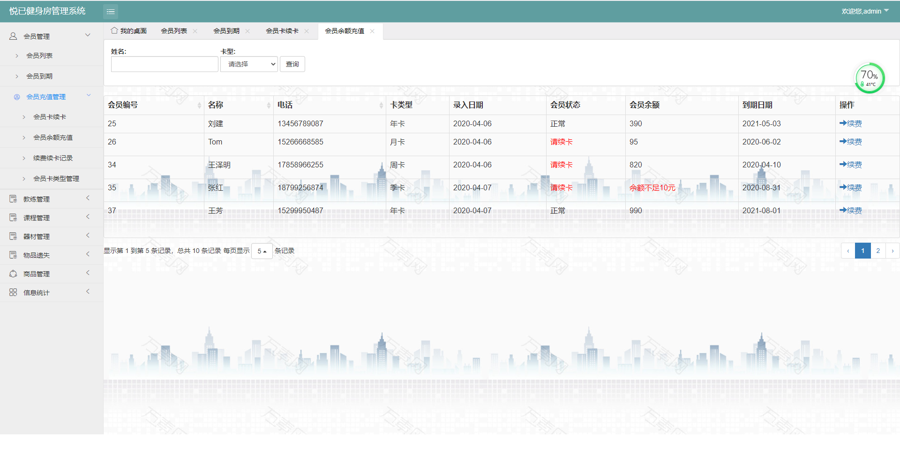
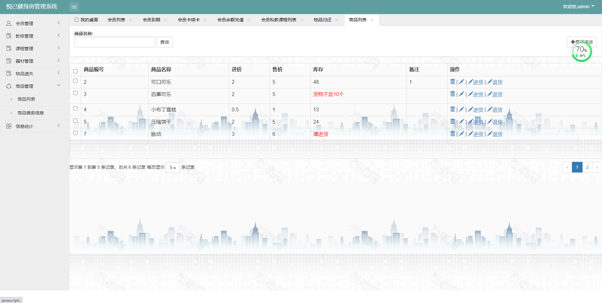

## 基于Springboot的健身房管理系统

###  获取sql数据库文件: 从戎源码网 (https://armycodes.com/) QQ: 386869957 QQ群: 377586148
###  所有系统地址: (https://github.com/YuLin-Coder/AllProjectCatalog) 
###  所有项目以及源代码本人均调试运行无问题 可支持远程安装部署调试、定制修改、代码讲解

## 项目介绍
基于Springboot的健身房管理系统

系统介绍
主要功能如下：
具备功能：
管理员登录模块
会员管理模块
教练管理模块
课程管理模块
器材管理模块
物品遗失管理模块
商品管理模块
信息统计模块等等。

## 项目技术
- 编程语言：Java
- 数据库：MySQL
- 项目管理工具：Maven
- 前端技术：HTML、CSS、JavaScript、jsp、BootStrap,Layui
- 后端技术：Spring、SpringMVC、Sping Data JPA

## 运行环境
- JDK版本：JDK1.8及以上
- 开发工具：IDEA、Ecplise、Myecplise都可以
- 数据库: MySQL5.7及以上
- Maven：maven3.0及以上

## 运行截图

